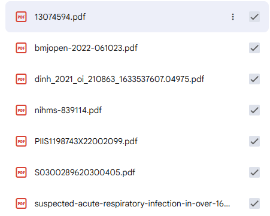
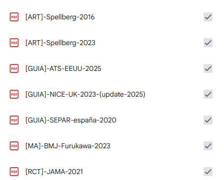

# >_ 3 pasos para hackear tu Gemini Notebook sanitario.

Tu cuaderno no está roto, está mal construido. Aquí te contamos cómo arreglarlo.

---

## Introducción

### La tercera diapo

Llevas dos meses preparando esta sesión. Ocho diapositivas montadas en un cuaderno de Gemini Notebook, el material ordenado, cada afirmación con su cita. Todo va bien. Nadie ha puesto ninguna cara rara.

Entonces alguien del fondo levanta la mano y pregunta de dónde sale lo de la tercera «diapo».

Abres la cita delante de todos. Y la fuente que subiste al cuaderno no dice eso… (*ups*).

Dice algo parecido. Es de otro documento del mismo tema, y el párrafo del que salió hablaba de otra cosa. Tú ves la diferencia en cuanto la lees porque tienes el criterio clínico. Pero ya lo has dicho en voz alta.

Lo peor no es haberte equivocado. Es que hasta ese momento no tenías forma de saberlo. Esa afirmación sonaba exactamente igual de bien que las anteriores.

No te ha fallado el criterio clínico. Te ha fallado el cuaderno.

> [ELEMENTO · simulación interactiva de una cita: el lector pulsa «ver cita» y se abre el panel con el fragmento resaltado, que no dice lo que afirma la diapositiva.]

### ¿Qué ha pasado ahí?

Gemini Notebook (antes NotebookLM) no lee tus documentos como los lees tú. Cuando subes una fuente, la corta en trozos pequeños y los guarda por separado. El documento entero no lo vuelve a ver.

Cuando le preguntas algo, no busca la respuesta: busca **los trozos que más se parecen a tu pregunta**. Coge un puñado y redacta la respuesta sobre la marcha.

> [ELEMENTO · diagrama animado en tres estados: documento entero → troceado → recuperación por parecido.]

**Léelo otra vez: los que más se parecen.**

No los más correctos. Ni los más fiables. Ni los que tienen mejor evidencia detrás.

Parecerse es lo único que sabe medir. Y por eso hay tres cosas que tu cuaderno no tiene forma de saber por sí mismo:

↳ cuál de tus documentos manda sobre los demás,
↳ cuál está actualizado y cuál no,
↳ cuál es el que usas de verdad en tu entorno y cuál es ruido (o directamente basura).

Piénsalo así: es como pedirle el resumen de un protocolo a alguien que no lo ha leído. Solo ha visto unas pocas frases recortadas, las que más se parecían a tu pregunta, y no sabe de qué capítulo salió cada una. Con eso te escribe una respuesta que suena a documento entero.

> **Compruébalo ahora mismo:** abre cualquier cita de tu cuaderno (el circulito gris) y mira cuánto texto hay resaltado en la fuente. Ese es el trozo del que salió esa frase.

De ahí sale lo de la tercera diapo. No fue el modelo ni el *prompt*. Fue que dentro de tu propio cuaderno había un fragmento que se parecía más a tu pregunta que el correcto. O que el correcto no estaba, y tiró del único que tenía.

### Lo que no te prometemos

Respuestas mejores. La magia potagia se la dejamos a otros.

Un cuaderno bien montado y uno mal montado dan respuestas parecidas más veces de las que te gustaría, y quien te diga lo contrario no ha comparado los dos. En el chat, el modelo es el mismo para todo el mundo.

La ventaja está en otra parte, y en nuestro trabajo vale más: poder revisar cada resultado y anticipar el fallo antes de exponerlo ante la sala.

> [ELEMENTO · tabla de dos columnas. «Lo que no cambia»: el modelo, la infraestructura, muchas de las respuestas. «Lo que sí cambia»: cada afirmación se puede rastrear; el fallo lo ves tú antes que el público.]

> **Un cuaderno bien construido no promete acertar más. Promete que el fallo se vea antes que el público.**

Es la diferencia entre defender un protocolo en una comisión y tener que retirarlo.

### Por qué falla: los tres fallos

#### Fallo 1 · Lo que se parece desplaza a lo que sirve

El problema nunca es el documento que no tiene nada que ver: ese no compite. El problema es el que va del mismo tema y no responde a tu pregunta. Ese sí compite, y a menudo gana. La guía que subiste «porque va de esto» es la que te tumba la cita.

Por eso subir fuentes «por si acaso» es **mala idea** en Gemini Notebook: cada fuente de más mete cientos de trozos nuevos que compiten con los buenos.

#### Fallo 2 · Lo que está en medio se recupera peor

Lo que queda enterrado en el centro de un documento largo aparece menos que lo que está al principio o al final. Un protocolo de ciento veinte páginas tiene un centro enorme donde las cosas desaparecen.

Por eso subir el manual completo no es la opción segura: es esconder la página que necesitas en mitad de todo lo demás.

#### Fallo 3 · Si no lo tiene, no te avisa

Si el trozo bueno no está en tu cuaderno, no te avisa: te contesta con el más parecido que tenga. El silencio no existe. Por eso una de las tres preguntas del paso 1 sirve exactamente para esto. Es el fallo que casi nadie ve, y el que más daño hace delante de gente.

> [ELEMENTO · tabla de tres filas: fallo / qué hace el cuaderno / qué pregunta lo detecta: fallo 1 → cruce, fallo 2 → localización, fallo 3 → ausencia.]

> Subir una fuente no es gratis: cada una compite con las que ya tienes. Y no cuenta solo cuántas subes, cuenta cuáles y en qué formato.

### La solución: cuidar tus fuentes

Todo lo que viene ahora ocurre antes de subir nada.

Esa es la frontera real entre usar el cuaderno y diseñarlo:

↳ el que lo **usa** arrastra PDF y luego se pelea con el prompt buscando la fórmula mágica;
↳ el que lo **diseña** decide qué fuentes va a haber ahí dentro y por qué.

> [ELEMENTO · pantalla propia para la cita:]
> **«No hay prompt que arregle un corpus mal montado.»**
> [ >_ Palabra de Saluhackers ]

Puedes escribir la pregunta más precisa del mundo: **si el fragmento bueno no está, o está sepultado entre cuatro parecidos, no va a salir.**

> [ELEMENTO · comparador de dos columnas con conmutador «usuario» / «hacker»: la misma tarea por las dos rutas, con los tres pasos del documento, no siete.]


---

## PASO 1 · Piensa, pregunta y filtra

Es lo que se salta casi todo el mundo, y es el paso del que cuelgan los otros dos.

### Escribe las tres preguntas

Crea un cuaderno, pero antes de subir la primera fuente escribe **las tres preguntas que ese cuaderno tiene que saber responder sí o sí**. Tres, y una de un tipo distinto:

1. **De localización.** Algo que está en una sola fuente, en un punto concreto. Tú ya sabes la respuesta y sabes dónde está. Sirve para comprobar si el cuaderno va a buscarla donde toca.

> **Ejemplo:** Según la guía SEPAR de 2020, ¿qué valores exactos definen la inestabilidad clínica que impide suspender el antibiótico?

2. **De cruce.** Algo que obliga a combinar dos fuentes porque ninguna lo dice sola. Aquí es donde el cuaderno o te resulta útil, o te enseña que se limita a resumir el documento que más se parece.

> **Ejemplo:** ¿En qué se diferencian la guía americana de 2025 y la española de 2020 en la duración recomendada, según los documentos que tengo cargados?

3. **De ausencia.** Algo que roza tu tema y no está en ninguna de tus fuentes. **Es la más importante de las tres y la que nadie hace nunca.** La respuesta correcta es que el cuaderno te diga que no lo tiene. Si en vez de eso te contesta con algo razonable, acabas de descubrir cuánto te puedes fiar de él…

> **Ejemplo:** ¿Qué duración de antibiótico se recomienda en una neumonía comunitaria **en niños**?
> (Todas las fuentes del cuaderno son de adultos.)

**Escríbelas en una nota del cuaderno. Vas a usarlas dos veces.**

Y sí, este es el paso que se salta casi todo el mundo. Todos menos los hackers de Gemini Notebook como tú.

> [ELEMENTO · cuaderno rellenable: tres campos, uno por tipo de pregunta, con botón de copiar. Es el elemento interactivo principal del artefacto.]

### Antes de subir fuentes, hazles esta pregunta

Nadie sube una fuente para que el cuaderno no la use. Lo que hace casi todo el mundo es subirla sin haberse parado a pensar por qué la sube. Y lo que no decides tú, lo decide el cuaderno por parecido.

Así que coge cada documento que ibas a subir y pásalo por la siguiente pregunta:

> **¿Qué parte de esta fuente responde al objetivo del cuaderno?**

La pregunta no es burocracia previa. Es el filtro consciente de calidad. Tenlo siempre activado cuando incluyas una fuente en un cuaderno.

Tres posibles respuestas:

- **Ninguna** → no la subas, por muy buena que sea.
- **Toda** → adelante, entera.
- **Un capítulo, un apartado, una tabla** → subes solo la mínima cantidad de información relevante.

Fíjate en que la pregunta no es qué necesitas tú hoy. Es para qué existe ese cuaderno, que es lo que decidiste hace un momento y no cambia mañana. Si el criterio se mueve con lo que te apetezca preguntar cada tarde, en dos semanas tienes otra vez un buzón.

La tercera respuesta es la más frecuente y la que casi nadie se atreve a dar. Contestar «el capítulo 4» en vez de «este manual» es, literalmente, la diferencia entre usar el cuaderno y diseñarlo.

Va a doler, porque las candidatas a caer o a recortarse son buenos documentos:

↳ La guía general que está bien pero no es la que usáis.
↳ El artículo que guardaste porque era interesante.
↳ El manual entero cuando lo que necesitas son ocho páginas.

Y esa es justamente la trampa: **no importa que vaya del tema. Va del tema y no responde, por eso hace daño.** Cada uno de esos documentos mete cientos de trozos que se parecen a tus preguntas sin contestarlas, y todos compiten con los buenos por aparecer en la respuesta.

Si un documento grande tiene dentro lo que necesitas, no lo subas entero: extrae esa parte y sube solo eso.

> **>_ PRINCIPIO HACKER:** «por si acaso» quiere decir «no sé qué parte subir». Y lo que no sabes para qué es, el cuaderno lo usa para lo que se parezca.

> [ELEMENTO · mini-ejercicio de cuatro tarjetas. El lector elige ninguna / toda / una parte, y al resolver ve el veredicto:]
> 1. *Manual de enfermedades infecciosas, 1.400 páginas, con un capítulo de neumonía.* → Una parte. Sube el capítulo únicamente; el resto esconde lo que sirve.
> 2. *Guía de neumonía nosocomial, misma sociedad, 2024.* → Ninguna. Va del tema y no responde: es otra neumonía, y sus trozos se parecen a tus preguntas.
> 3. *Ensayo clínico que compara dos duraciones de antibiótico en neumonía comunitaria.* → Toda. Responde a la pregunta de cruce.
> 4. *Protocolo de antibioterapia de tu área, 2026.* → Una parte: el apartado de neumonía comunitaria.

---

## PASO 2 · Extrae, formatea y nombra

Ya sabes qué entra en tu cuaderno. Ahora hay dos decisiones sobre cómo entra, y las dos se notan en las respuestas.

### El formato condiciona lo que se recupera

El cuaderno trocea lo que le das, así que la estructura del documento decide cómo son los trozos. Un PDF con texto nativo, encabezados y párrafos produce fragmentos que conservan el sentido de cada apartado. Un PDF escaneado con mal reconocimiento óptico produce fragmentos con errores y sin jerarquía. La diferencia no es estética.

No hace falta convertirlo todo. Si el PDF es nativo y está bien maquetado, súbelo tal cual. Convierte a texto limpio cuando esté escaneado, cuando la maquetación a dos columnas parta las frases por la mitad o cuando el pie de página se repita cuarenta veces.

Puedes usar alguna herramienta en línea gratuita como [MarkItDown](https://markitdown.online/es) para convertir `PDF` a `.md`.

### El caso de las tablas

Las tablas son el formato donde más se nota qué estás subiendo y para qué.

Gemini Notebook lee razonablemente bien una tabla de un PDF nativo con encabezados limpios, y desde las actualizaciones de 2026 lo hace mejor que antes. Si ese es tu caso, no toques nada: súbela tal cual y sigue.

El problema aparece cuando la tabla se entiende por dónde están las cosas, y no por lo que dicen. Eso pasa más de lo que parece:

↳ La celda vacía o el «ídem» que significa «lo mismo que la fila de arriba».
↳ El asterisco al pie que dice «ajustar en mayores de 75 años» y afecta a media tabla.
↳ La tabla que se parte en dos páginas y en la segunda ya no se ven los encabezados: filas de números sin nada que diga de qué son.
↳ Las abreviaturas que solo se explican en la leyenda, tres párrafos más abajo.

Tú resuelves las cuatro cosas de un vistazo, porque miras la página entera y conoces el documento. El cuaderno no ve la página: ve trozos sueltos, y el trozo que le toca no siempre trae consigo la fila de arriba, ni el pie, ni el encabezado. Lo que no sabe lo resuelve por probabilidad.

Para esos casos, la solución es **traducir la tabla a prosa**: convertir cada fila en una frase que contenga todo lo que esa fila relaciona, con las abreviaturas escritas enteras y el matiz del pie de página dentro de la frase que le corresponde. Luego subes esas frases como fuente (texto libre), en lugar de la tabla.

> [ELEMENTO · comparador con conmutador de tres estados sobre una misma tabla: «lo que ves tú» / «lo que ve el cuaderno» / «traducida».]
>
> **Estado 1, lo que ves tú.** Una tabla de aspecto clínico, pequeña, con las cuatro trampas del texto a la vista: encabezado de columnas, una celda con «ídem», un asterisco en una celda cuyo pie está debajo de la tabla, y una abreviatura que solo se explica en la leyenda. Página completa, todo visible, todo se entiende.
>
> **Estado 2, lo que ve el cuaderno.** La misma tabla, pero solo se ilumina un rectángulo: tres filas del medio. Fuera del rectángulo, todo atenuado. Dentro no está el encabezado, así que las columnas son números sin nombre; el «ídem» apunta a una fila que queda fuera; el asterisco está, pero el pie no; la abreviatura está, pero la leyenda no. No hace falta texto explicativo: es la captura de una cita con el trozo resaltado, que el lector ya ha visto en la introducción, aplicada a una tabla.
>
> **Estado 3, traducida.** Dos o tres frases, y cada una lleva dentro lo que en el estado 2 se había quedado fuera: el nombre de la columna, el valor heredado del «ídem», el matiz del asterisco, la abreviatura escrita entera. Resaltado con el mismo color del estado 2, para que se vea que ahora el trozo se basta solo.
>
> **Restricciones.** Tabla inventada, sin fármacos ni dosis reales, con placeholders tipo «Fármaco A» y etiqueta «ejemplo ilustrativo». El conmutador es el mismo componente del comparador «usuario / hacker» de la introducción, con un estado más: no hay que diseñar nada nuevo, solo reutilizarlo.

No hace falta hacerlo a mano: pídeselo a la IA que uses y te devuelve las frases en un minuto. Suele resolver bien los símbolos y las abreviaturas por el propio patrón de la tabla, pero es tu trabajo repasarlas contra la original antes de subirlas. Y ahí está la ventaja escondida: te obliga a mirar de cerca una tabla que probablemente llevabas meses consultando en diagonal.

**Dos avisos antes de ponerte.** Hazlo solo con las tablas que de verdad vayas a consultar; convertir todas las del documento es trabajo tirado. Y no te pases troceando: veinte frases casi idénticas son veinte candidatas compitiendo entre sí, y acabas con un cuaderno que ve menos que antes.

### El nombre es tu trazabilidad en público

Parece lo de menos y es lo que se proyecta en pantalla delante de doce personas. El cuaderno cita por título. Si el título es `13074594.pdf`, eso es lo que aparece cuando alguien pregunta de dónde sale un dato.

El nombre no es solo una etiqueta para ti: **es un metadato de recuperación y es tu trazabilidad en público.**

Puedes definir el tuyo particular. Nosotros proponemos una etiqueta de tipo entre corchetes, un descriptor semántico y el año:

```
[GUIA]-NICE-UK-2023-(update-2025)
[MA]-BMJ-Furukawa-2023
[RCT]-JAMA-2021
```

Las etiquetas también son personalizables, por ejemplo:

↳ Guía clínica (GUIA)
↳ Protocolo (PR)
↳ Ficha técnica (FT)
↳ Ensayo clínico (EC)
↳ Informe (INF), etc.

Da igual qué siglas uses mientras sean siempre las mismas. Ganas dos cosas: **el cuaderno distingue tipos de fuente sin buscar dentro, y tú ves de un vistazo qué tienes y de qué año, sin abrir nada.**

> [ELEMENTO · antes/después con dos listas de fuentes reales, la del cuaderno sin arquitecturar y la del arquitecturado, una al lado de la otra.]




Además, si trabajas así puedes tener dentro de la configuración personalizada del cuaderno una «jerarquía de fuentes» que permita obtener resultados mejor contextualizados y relevantes.

---

## PASO 3 · Comprueba

Ya tienes filtradas, subidas y correctamente nombradas tus fuentes del cuaderno. Ahora saca la nota del paso 1. Hazle las tres preguntas al cuaderno. Esta vez de verdad en el chat.

Cada una comprueba una cosa distinta.

**La de localización** comprueba que llega al sitio. Tú sabes en qué fuente está el dato y en qué punto; el cuaderno tiene que citar esa fuente, y al abrir la cita, el trozo resaltado tiene que decir lo que tú sabías. Si cita otra, o cita la buena pero por otra parte, el dato está enterrado o lo ha tapado un parecido.

**La de cruce** comprueba que combina en vez de resumir. La respuesta tiene que apoyarse en las dos fuentes, y eso se ve en las citas. Si solo aparece una, ha cogido el documento que más se parecía a la pregunta y ha contestado con él. Suena completo. No lo es.

**La de ausencia** comprueba que sabe callarse. Aquí no hay nada que abrir: pasa si te dice que no lo tiene. Si contesta algo razonable, con su cita, esa cita apunta a un trozo que se parece a tu pregunta y no la responde. Es el fallo que no se ve leyendo, porque la respuesta está bien escrita.

> [ELEMENTO · lista de verificación interactiva de tres filas, una por pregunta, cada una con su criterio de «pasa». Al marcar la tercera, la transición que devuelve al lector a la escena de la primera pantalla, esta vez con la cita abierta y coincidiendo.]

Y en cualquiera de las tres, el gesto es el mismo: abre la cita y lee el trozo resaltado. Es la pregunta desde el fondo de la sala, solo que ahora la haces tú, sentado, sin nadie mirando.

Las tres preguntas son el mismo instrumento usado dos veces: al principio definen el cuaderno; al final lo ponen a prueba. Entre medias no se tocan. Por eso escribirlas antes de subir nada no es papeleo previo: es lo único que te permite saber, después, si el cuaderno funciona o solo lo parece.

Si las tres pasan, tienes un cuaderno que puedes defender. No uno que acierta más: uno en el que sabes de dónde sale cada cosa antes de decirla en voz alta.

---

## Cuándo esto compensa y cuándo no

Esto cuesta tiempo. Filtrar cuesta, traducir una tabla aburre, renombrar veinte archivos es un rato que nadie te devuelve. Así que no lo hagas siempre.

No compensa en un cuaderno de usar y tirar. Tres artículos que tienes que leerte esta tarde y no vas a volver a abrir: súbelos y ya. El método cuesta más de lo que devuelve.

Compensa en tres situaciones, y son fáciles de reconocer:

1. Cuando **el cuaderno se va a usar muchas veces.**
2. Cuando **lo van a tocar otras personas** y no puedes estar tú al lado explicando qué es cada archivo.
3. Cuando **lo que sale de ahí acaba en un documento que alguien puede cuestionar**: una sesión, un informe, un protocolo o algo que se firma.

> «Si tu caso es el tercero, el método no es opcional.»

> [ELEMENTO · tabla de dos columnas, «no compensa» / «compensa», con los casos de arriba ya escritos.]

---

## EXTRA: Tres límites que no podemos traspasar

- **Datos de pacientes, nunca.** No hay ninguna versión autoalojada en servidores propios ni un modo sin conexión, así que todo lo que subas vivirá en servidores de Google. Cualquier fuente con datos identificables se elimina/anonimiza antes o no entra. No hay término medio.

- **Que cite no significa que sea verdad.** La cita te dice de qué fragmento salió el texto. No te dice que fuera el fragmento más relevante, ni que la lectura sea la correcta, ni que no haya otra fuente tuya diciendo lo contrario. La trazabilidad te da dónde comprobar. No algo comprobado. Y esto no lo arregla ningún método: es la base de la que parte todo lo demás.

- **Localizar y comparar, sí; decidir, no.** El cuaderno encuentra qué dicen tus documentos y los pone uno al lado del otro. La decisión clínica es tuya, y la verificación contra la fuente original también. Este método existe para que puedas ejercerla con algo sólido debajo, no para ahorrártela.

> [ELEMENTO · tres tarjetas con iconografía propia. Sin emoticonos.]

---

## Lo que viene después

Haz esto y tendrás un cuaderno auditable. Se nota a la primera sesión.

Pero esto es solo el principio. La arquitectura inicial del cuaderno es método e inversión de diseño. Los resultados vienen después, cuando entiendes que tu cuaderno es un auténtico sistema de IA.

Y aun así te va a quedar un agujero, que verás a la primera semana. Todo lo que no le hayas dicho, lo decide él. Qué fuente manda cuando dos de las tuyas se contradicen. Qué hacer cuando el dato sencillamente no está. Si te responde en tres líneas o en dos páginas. Ninguna de esas cosas la arreglan las fuentes, por muy bien montadas que estén: no son un problema de material, son un problema de comportamiento.

Se arregla un piso más arriba, en la configuración personalizada del cuaderno: se escribe una vez y gobierna todas las conversaciones sin que tengas que repetirlo. Ahí es donde un cuaderno deja de responder por defecto y empieza a responder como tú hayas decidido.

Y un piso más arriba todavía hay otra cosa, que ya no es un cuaderno sino una **base de conocimiento** que otros agentes consumen sin que tú estés delante. Esa frontera existe y se ve desde aquí. No es para hoy.

> [ELEMENTO · diagrama de tres capas: arquitectura (hecha), comportamiento (bloqueada), conexión (apenas insinuada).]

Lo que has hecho en estas páginas no sale del prompt. Sale de cómo está construido el cuaderno que hay detrás.

Sobre justo eso irá nuestro primer curso, el cual lanzaremos a finales de septiembre. ¿Te vienes a *hackear* Gemini Notebook?

> [CTA · lista de espera] **Apúntate a la lista de espera y te avisamos cuando salga.**

---

## Bibliografía

1. Zhang G, Xu Z, Jin Q, Chen F, Fang Y, Liu Y, et al. Leveraging long context in retrieval augmented language models for medical question answering. npj Digit Med. 2025;8:239. doi:10.1038/s41746-025-01651-w
2. Cuconasu F, Trappolini G, Siciliano F, Filice S, Campagnano C, Maarek Y, et al. The Power of Noise: Redefining Retrieval for RAG Systems. En: SIGIR '24; 2024. p. 719-729. Disponible en: https://arxiv.org/abs/2401.14887
3. Liu NF, Lin K, Hewitt J, Paranjape A, Bevilacqua M, Petroni F, et al. Lost in the Middle: How Language Models Use Long Contexts. Trans Assoc Comput Linguist. 2024;12:157-173.
4. Anthropic. Effective context engineering for AI agents [Internet]. 29 sep 2025. Disponible en: https://www.anthropic.com/engineering/effective-context-engineering-for-ai-agents
5. Akarsu M, et al. From BM25 to Corrective RAG: Benchmarking Retrieval Strategies for Text-and-Table Documents. arXiv:2604.01733 [preimpresión]. 2 abr 2026. doi:10.48550/arXiv.2604.01733
